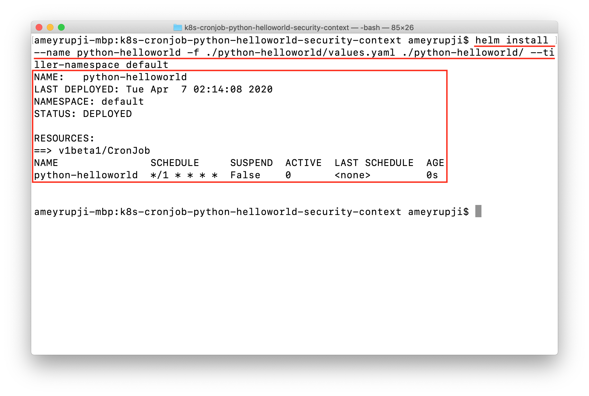
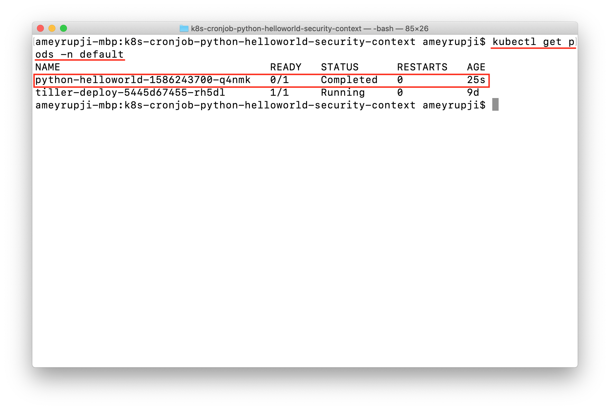
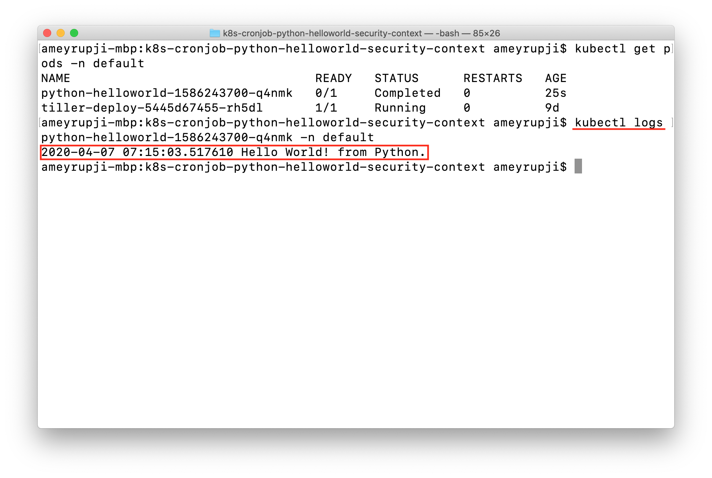

| [◂ Previous](https://github.com/ameyrupji-k8s/k8s-cronjob-python-helloworld) |
|-----|

# k8s-cronjob-python-helloworld-security-context


Taking the simple python hello world script further. This example adds Security Context settings while deploying to kubernetes cluster.  A security context defines privilege and access control settings for a Pod or Container.

Read more about security context click [here](https://kubernetes.io/docs/tasks/configure-pod-container/security-context/).

**Note:** Refer [k8s-cronjob-python-helloworld](https://github.com/ameyrupji-k8s/k8s-cronjob-python-helloworld) repo.


## Prerequisites

- Python - >=3.5
- Visual Studio Code
- Docker
- Helm
- Tiller on the Kubernetes cluster

## System Configuration at time of test

- macOS Catalina - Version 10.15.3
- Python - Version 3.7.6
- Docker Desktop - Version 2.2.0.4 (43472)
- Kubernetes - v1.15.5
- Helm - v2.14.3

## Initial Setup


### Adding User and Group to Docker Container

Add the following lines to `Dockerfile` before the procfile command is called.

```docker
RUN addgroup -g 1988 arupji-helloworld-group
RUN adduser -D -s / -u 1988 arupji-helloworld-user -G arupji-helloworld-group

RUN chown 1988:1988 helloworld.py \
&& chown 1988:1988 procfile

USER 1988
```

This creates an User and Group with id `1988`. Gives ownership of the `helloworld.py`. More might be required for specific use cases. Also sets the context to user with id 1988 with the command `USER 1988`.


### Creating Python code

Follow the steps outlined in [docker-python-helloworld](https://github.com/ameyrupji-k8s/docker-python-helloworld) GitHub project to create a docker container. 

### Adding Security Context

Add this code to this `python-helloworld-chart/templates/cronjob.yaml` in the `spec.jobTemplate.spec.template.spec` section:

```yaml
          securityContext:
            runAsNonRoot: true
            runAsUser: 1988
            fsGroup: 1988
```

Similar to the above comment. This starts the pod as a non root user and with user and group id `1988`

**Note:** Rebuild your docker container using `docker build -t python-helloworld:v1 .` as there is a slight change also to the `Dockerfile`.


### Install CronJob

Use this command to install the CronJob.

`helm install --name python-helloworld -f ./python-helloworld/values.yaml ./python-helloworld/ --tiller-namespace default`



## Test

### Verify that the CronJob runs successfully

Verify that the CronJob runs successfully waiting for a min and then running the `kubectl` command `kubectl get pods -n default`



Check the pod logs using `kubectl` command `kubectl logs {pod_name} -n default`




## Cleanup

To delete the container that was created use this command: `docker rm {container_id}`

To delete the docker image that was created: `docker rmi python-helloworld:v1`


## Useful Links

- https://medium.com/@pandit.summit/kubernetes-cron-job-with-python-image-in-minikube-windows-10-ac33851d573d
- https://github.com/ameyrupji-k8s/k8s-cronjob-python-helloworld
- https://github.com/ameyrupji-k8s/k8s-spring-boot-helloworld-security-context

| Next ▸ |
|-----|
